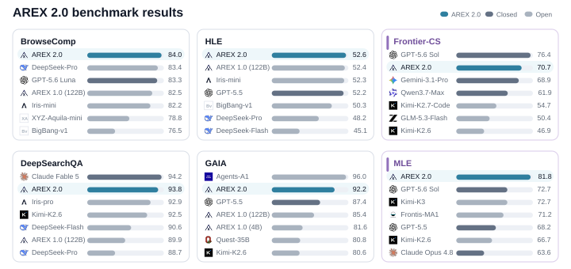

<div align="center">


<p><strong>Research、算法编程和机器学习评测</strong></p>

<a href="README.md">English</a> · <a href="docs/evaluation.zh-CN.md">评测说明</a> · <a href="docs/configuration.zh-CN.md">配置说明</a> · <a href="https://545999961.github.io/AREX-v2/">项目主页</a>

<br />


</div>

AREX 是 `self_evolving_v15` 使用的评测仓库。它把 research 评测器、
Frontier-CS judge 和 MLE-bench Lite 放在同一个仓库中。大体积、需要授权、
加密或受许可限制的数据不会提交到 Git。

## 效果概览

仓库内置一张覆盖三条评测线的项目效果图，使用 SVG 保存，在 GitHub 页面上
保持清晰，也方便放进报告。



只有在 model endpoint、任务范围、工具和 judge 配置一致时，分数才具有可比性。
各条评测线的计分信号见[评测说明](docs/evaluation.zh-CN.md)。

## 这个仓库评测什么

| 评测线 | Benchmark | 衡量内容 | 入口 |
| --- | --- | --- | --- |
| Research | BrowseComp、HLE、GAIA、DeepSearch-QA 等 | 搜索、网页访问和长程推理 | `python3 evaluate.py 数据集` |
| 算法编程 | Frontier-CS | C++17 解答通过 checker case 的情况 | `python3 -m arex_v2 algorithmic ...` |
| 机器学习 | MLE-bench Lite | 比赛提交结果和 host grader 分数 | `python3 -m arex_v2 mle ...` |

用 `python3 -m arex_v2 list` 查看所有已注册的 research 数据集。数据集选择
放在仓库最外层：选定数据集后，包装器会自动调用对应评测器和数据路径。

## 快速开始

### 1. 安装

需要 Python 3.10 或更高版本。按要运行的评测线安装依赖：

```bash
python3 -m venv .venv
source .venv/bin/activate

pip install -e '.[research]'    # research 基准
# pip install -e '.[frontier]'  # Frontier-CS
# pip install -e '.[all]'       # 全部 Python 依赖

python3 -m arex_v2 doctor
```

### 2. 准备数据

```bash
# 查看所有已注册 research 数据集的状态
python3 -m arex_v2 download --list

# 准备一个 research 数据集
python3 -m arex_v2 download BrowseComp

# 准备 research 数据和公开 Frontier-CS 题库
python3 -m arex_v2 download --all
```

BrowseComp 和 DeepSearch-QA 使用公开发布文件；HLE、GAIA 需要接受 Hugging Face
条款并设置 `HF_TOKEN`。准备过程可以重复执行，下载失败不会删除已经完成的数据。

Frontier-CS 题目会放在 `algorithmic/problems/`。需要固定镜像并校验压缩包时：

```bash
python3 scripts/download_algorithmic.py \
  --url https://mirror.example/frontier-cs.tar.gz \
  --sha256 SHA256_HEX
```

### 3. 配置模型

复制安全的示例文件，填写本地值并加载到当前 shell：

```bash
cp configs/model.env.example .env
# 编辑 .env
set -a; source .env; set +a
```

research 评测使用 `AREX_MODEL_NAME`、`MODEL_API_KEY` 中保存的 key，以及可选
的 `AREX_BASE_URL`；同时需要本地 `AREX_TOKENIZER_PATH`。搜索和网页访问使用
`SERPER_API_KEY`、`JINA_API_KEY`。secret 只从环境变量读取，不会进入命令行或
提交到仓库。

### 4. 运行评测

research 评测只把数据集作为位置参数：

```bash
# 查看最终构造的命令，不访问任何服务
python3 evaluate.py BrowseComp --n 1 --dry-run

# 评测行号 [0, 10)
python3 evaluate.py BrowseComp --n 10 --save-path runs/browsecomp-10

# 评测行号 [100, 120)
python3 evaluate.py BrowseComp --start-index 100 --n 20

# 使用同一范围运行两个数据集
python3 evaluate.py BrowseComp HLE --n 5 --save-path runs/smoke
```

等价的模块命令是 `python3 -m arex_v2 evaluate BrowseComp`；`research` 和
`eval` 仍然保留。需要把数据放到其他位置时使用 `--data-root PATH`，只选择一个
数据集时可以用 `--data-path PATH`。包装器会在启动上游评测器前检查数据路径。

另外两条评测线：

```bash
# Frontier-CS：题目编号和 C++17 解答
python3 -m arex_v2 algorithmic 1 path/to/solution.cpp --backend docker

# MLE-bench Lite：准备、运行，再用 host grader 评分
MLE_BENCH=$HOME/mle-bench python3 -m arex_v2 mle leaf-classification --prepare
MLE_BENCH=$HOME/mle-bench python3 -m arex_v2 mle leaf-classification
MLE_BENCH=$HOME/mle-bench \
  bash vendor/mle_lite/scripts/grade.sh runs/<run-dir> leaf-classification
```

## 运行后查看什么

Research 会在 `<save-path>/<dataset>/` 下逐题写入 `result.json`。汇总
`score_result.score` 前先检查 `status`、`official_scorer`、`judge_raw` 和
错误字段。Frontier-CS 看 checker case 分数，MLE-bench 看 `grade.log` 中 host
grader 的字段。每个结果同时记录 model、端点、任务范围、mode、Git commit 和数据
checksum。

详细计分规则见[评测说明](docs/evaluation.zh-CN.md)，高级参数见
[配置说明](docs/configuration.zh-CN.md)。英文说明在 [README.md](README.md)，上游
版本和许可见 [THIRD_PARTY_NOTICES.md](THIRD_PARTY_NOTICES.md) 与 [SNAPSHOT.txt](SNAPSHOT.txt)。

## 目录结构

```text
arex_v2/                  CLI、数据集目录和后端适配器
vendor/research/          research 评测器和数据集配置
vendor/frontier_cs/       Frontier-CS Python 快照
vendor/mle_lite/          MLE-bench Lite harness
algorithmic/              Frontier-CS judge 和运行文件
scripts/                  数据准备和诊断脚本
configs/                  安全的本地配置示例
docs/                     配置和计分说明
assets/                   logo 和 benchmark 效果图
site/                     静态项目主页
```

运行数据、凭据、结果目录和下载的题库都会被 Git 忽略。
